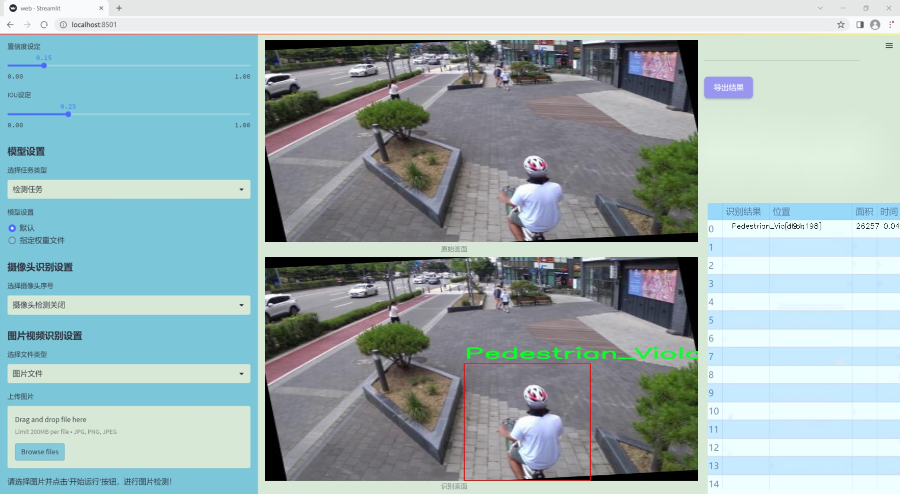
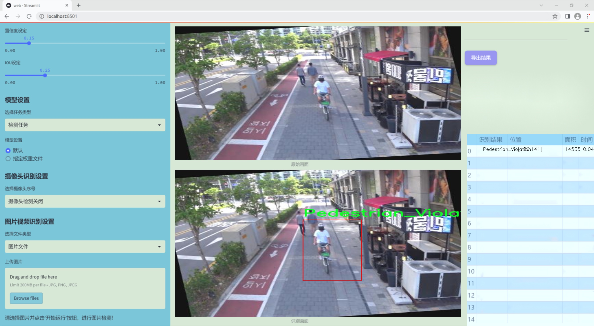
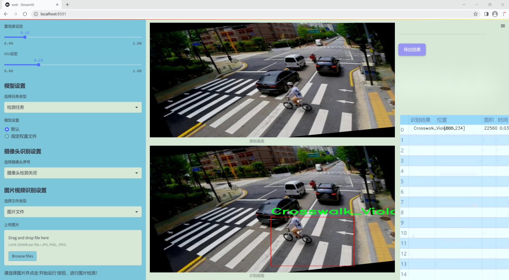
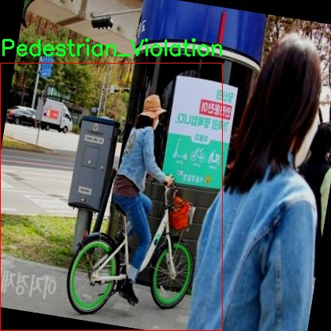
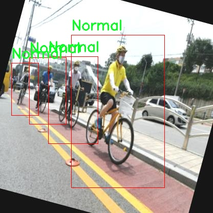
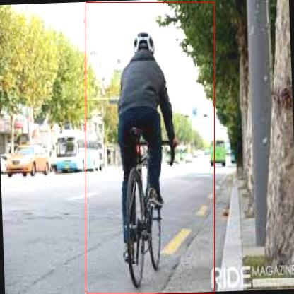
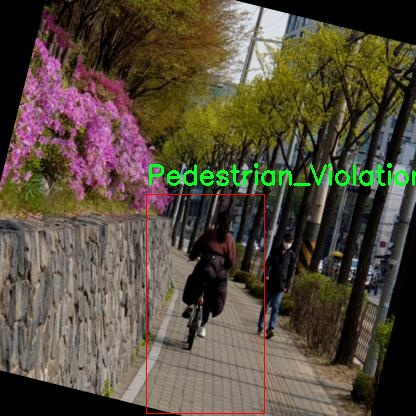
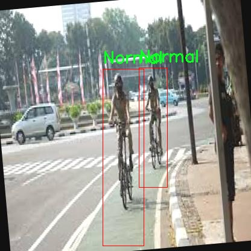

# 改进yolo11-GDFPN等200+全套创新点大全：交通违规行为检测系统源码＆数据集全套

### 1.图片效果展示







##### 注意：由于项目一直在更新迭代，上面“1.图片效果展示”和“2.视频效果展示”展示的系统图片或者视频可能为老版本，新版本在老版本的基础上升级如下：（实际效果以升级的新版本为准）

  （1）适配了YOLOV11的“目标检测”模型和“实例分割”模型，通过加载相应的权重（.pt）文件即可自适应加载模型。

  （2）支持“图片识别”、“视频识别”、“摄像头实时识别”三种识别模式。

  （3）支持“图片识别”、“视频识别”、“摄像头实时识别”三种识别结果保存导出，解决手动导出（容易卡顿出现爆内存）存在的问题，识别完自动保存结果并导出到tempDir中。

  （4）支持Web前端系统中的标题、背景图等自定义修改。

  另外本项目提供训练的数据集和训练教程,暂不提供权重文件（best.pt）,需要您按照教程进行训练后实现图片演示和Web前端界面演示的效果。

### 2.视频效果展示

[2.1 视频效果展示](https://www.bilibili.com/video/BV1ksyzYNEHr/)

### 3.背景

##### 项目来源 [人工智能促进会 2024.10.20](https://kdocs.cn/l/cszuIiCKVNis)

研究背景与意义

随着城市化进程的加快，交通流量的增加使得交通安全问题日益突出。交通违规行为不仅导致了交通事故的频发，也对城市的交通管理和公共安全构成了严峻挑战。为了有效应对这一问题，智能交通系统的建设显得尤为重要。近年来，深度学习技术的迅猛发展为交通违规行为的自动检测提供了新的思路和方法。尤其是YOLO（You Only Look Once）系列目标检测算法，以其高效的实时检测能力，逐渐成为交通监控领域的研究热点。

本研究旨在基于改进的YOLOv11模型，构建一个高效的交通违规行为检测系统。我们所使用的数据集包含1900张图像，涵盖了多种交通违规行为的类别，包括行人违规过马路、行人违规进入斑马线、未佩戴安全头盔、正常行驶、乘客违规行为以及交通信号灯违规等。这些类别的多样性为模型的训练提供了丰富的样本，有助于提高检测的准确性和鲁棒性。

通过对YOLOv11模型的改进，我们期望在保持高检测速度的同时，提升模型对不同交通违规行为的识别能力。该系统的实现不仅能够为交通管理部门提供实时监控和数据分析的支持，还能够为交通参与者提供安全警示，进而促进交通文明和安全意识的提升。此外，基于深度学习的交通违规行为检测系统也为后续的智能交通系统发展奠定了基础，推动了交通领域的智能化进程。因此，本研究具有重要的理论价值和实际应用意义。

### 4.数据集信息展示

##### 4.1 本项目数据集详细数据（类别数＆类别名）

nc: 7
names: ['Crossing_Violation', 'Crosswalk_Violation', 'Helmet_Violation', 'Normal', 'Passenger_Violation', 'Pedestrian_Violation', 'Trafficlight_Violation']


该项目为【目标检测】数据集，请在【训练教程和Web端加载模型教程（第三步）】这一步的时候按照【目标检测】部分的教程来训练

##### 4.2 本项目数据集信息介绍

本项目数据集信息介绍

本项目所使用的数据集名为“0-5”，旨在为改进YOLOv11的交通违规行为检测系统提供高质量的训练数据。该数据集包含七个主要类别，涵盖了多种交通违规行为，具体包括：Crossing_Violation（越线违规）、Crosswalk_Violation（人行道违规）、Helmet_Violation（未佩戴头盔违规）、Normal（正常行为）、Passenger_Violation（乘客违规）、Pedestrian_Violation（行人违规）以及Trafficlight_Violation（交通信号灯违规）。这些类别的设置不仅反映了交通管理中的关键问题，也为系统的智能识别提供了丰富的场景和实例。

数据集“0-5”经过精心标注，确保每个类别的样本数量均衡且具有代表性，以便于训练模型时能够有效学习到各类违规行为的特征。每个类别都包含多种不同的场景和条件，例如不同的天气、时间段以及交通流量，这些因素的多样性使得模型在实际应用中能够更好地适应复杂的交通环境。此外，数据集中的样本均为高分辨率图像，确保了在训练过程中能够提取到更为细致的特征信息。

通过对“0-5”数据集的深入分析和使用，我们期望能够显著提升YOLOv11在交通违规行为检测中的准确性和鲁棒性。这不仅有助于改善交通安全管理，也为未来的智能交通系统奠定了坚实的基础。总之，本项目的数据集为研究和开发提供了重要的支持，使得交通违规行为的自动检测成为可能，进而推动智能交通技术的发展。











### 5.全套项目环境部署视频教程（零基础手把手教学）

[5.1 所需软件PyCharm和Anaconda安装教程（第一步）](https://www.bilibili.com/video/BV1BoC1YCEKi/?spm_id_from=333.999.0.0&vd_source=bc9aec86d164b67a7004b996143742dc)


[5.2 安装Python虚拟环境创建和依赖库安装视频教程（第二步）](https://www.bilibili.com/video/BV1ZoC1YCEBw?spm_id_from=333.788.videopod.sections&vd_source=bc9aec86d164b67a7004b996143742dc)

### 6.改进YOLOv11训练教程和Web_UI前端加载模型教程（零基础手把手教学）

[6.1 改进YOLOv11训练教程和Web_UI前端加载模型教程（第三步）](https://www.bilibili.com/video/BV1BoC1YCEhR?spm_id_from=333.788.videopod.sections&vd_source=bc9aec86d164b67a7004b996143742dc)


按照上面的训练视频教程链接加载项目提供的数据集，运行train.py即可开始训练



     Epoch   gpu_mem       box       obj       cls    labels  img_size
     1/200     20.8G   0.01576   0.01955  0.007536        22      1280: 100%|██████████| 849/849 [14:42<00:00,  1.04s/it]
               Class     Images     Labels          P          R     mAP@.5 mAP@.5:.95: 100%|██████████| 213/213 [01:14<00:00,  2.87it/s]
                 all       3395      17314      0.994      0.957      0.0957      0.0843

     Epoch   gpu_mem       box       obj       cls    labels  img_size
     2/200     20.8G   0.01578   0.01923  0.007006        22      1280: 100%|██████████| 849/849 [14:44<00:00,  1.04s/it]
               Class     Images     Labels          P          R     mAP@.5 mAP@.5:.95: 100%|██████████| 213/213 [01:12<00:00,  2.95it/s]
                 all       3395      17314      0.996      0.956      0.0957      0.0845

     Epoch   gpu_mem       box       obj       cls    labels  img_size
     3/200     20.8G   0.01561    0.0191  0.006895        27      1280: 100%|██████████| 849/849 [10:56<00:00,  1.29it/s]
               Class     Images     Labels          P          R     mAP@.5 mAP@.5:.95: 100%|███████   | 187/213 [00:52<00:00,  4.04it/s]
                 all       3395      17314      0.996      0.957      0.0957      0.0845


###### [项目数据集下载链接](https://kdocs.cn/l/cszuIiCKVNis)

### 7.原始YOLOv11算法讲解


## YOLO11介绍

Ultralytics YOLO11是一款尖端的、最先进的模型，它在之前YOLO版本成功的基础上进行了构建，并引入了新功能和改进，以进一步提升性能和灵活性。
**YOLO11设计快速、准确且易于使用，使其成为各种物体检测和跟踪、实例分割、图像分类以及姿态估计任务的绝佳选择。**


**结构图如下：**


### **C3k2**

**C3k2，结构图如下**


**C3k2，继承自类`C2f，其中通过c3k设置False或者Ture来决定选择使用C3k还是`**Bottleneck


**实现代码** **ultralytics/nn/modules/block.py**

### C2PSA介绍

**借鉴V10 PSA结构，实现了C2PSA和C2fPSA，最终选择了基于C2的C2PSA（可能涨点更好？）**


**实现代码** **ultralytics/nn/modules/block.py**

### Detect介绍

**分类检测头引入了DWConv（更加轻量级，为后续二次创新提供了改进点），结构图如下（和V8的区别）：**


### 8.200+种全套改进YOLOV11创新点原理讲解

#### 8.1 200+种全套改进YOLOV11创新点原理讲解大全

###### 由于篇幅限制，每个创新点的具体原理讲解就不全部展开，具体见下列网址中的创新点对应项目的技术原理博客网址【Blog】（创新点均为模块化搭建，原理适配YOLOv5~YOLOv11等各种版本）

[8.1 技术原理博客【Blog】网址链接](https://gitee.com/qunmasj/good)


#### 8.2 精选部分改进YOLOV11创新点原理讲解

###### 这里节选部分改进创新点展开原理讲解(完整的改进原理见上图和[技术博客链接](https://gitee.com/qunmasj/good))【如果此小节的图加载失败可以通过CSDN或者Github搜索该博客的标题访问原始博客，原始博客图片显示正常】
### YOLOv11简介

YOLOv11 是 Ultralytics 公司继 YOLOv11 算法之后开发的下一代算法模型，目前支持图像分类、物体检测和实例分割任务。YOLOv11 是一个 SOTA 模型，它建立在之前YOLO 系列模型的成功基础上，并引入了新的功能和改进，以进一步提升性能和灵活性。具体创新包括：一个新的骨干网络、一个新的 Ancher-Free 检测头和一个新的损失函数，可以在从 CPU 到 GPU 的各种硬件平台上运行。注意到ultralytics 并没有直接将开源库命名为 YOLOv11，而是直接使用 Ultralytics这个单词，原因是Ultralytics这个库的定位是算法框架，而非特指某一个特定算法，其希望这个库不仅仅能够用于 YOLO 系列模型，同时也能支持其他的视觉任务如图像分类、实例分割等。下图画图YOLOv11目标检测算法同其他YOLO系列算法（YOLOv11、6、7）的实验对比图，左边是模型参数量对比，右边是速度对比。


下面两个表分别是YOLOv11和YOLOv11（v7.0版本）官方在 COCO Val 2017 数据集上测试结果，从中看出 YOLOv11 相比 YOLOv11 精度提升大，但是 N/S/M 模型相应的参数量、FLOPS等提高了不少。


#### YOLOv11概述
提供了一个全新的SOTA模型，和YOLOv11一样，基于缩放系数也提供了 N/S/M/L/X 尺度的不同大小模型，用于满足不同场景需求，同时支持图像分类、目标检测、实例分割和姿态检测任务
在骨干网络和Neck部分将YOLOv11的C3结构换成了梯度流更丰富的 C2f 结构，并对不同尺度模型调整了不同的通道数，大幅提升了模型性能；需要注意的是C2f 模块中存在Split等操作对特定硬件部署没有之前那么友好


Head部分换成了目前主流的解耦头结构，将分类和检测头分离，同时也从 Anchor-Based换成了Anchor-Free Loss
计算方面采用了 TaskAlignedAssigner 正样本分配策略，并引入了 Distribution Focal Loss
下图画出YOLOv11目标检测算法的整体结构图


#### YOLOv11模型
YOLOv11目标检测算法的模型配置文件如下：


从配置文件可以看出，YOLOv11与YOLOv11模型最明显的差异是使用C2F模块替换了原来的C3模块，两个模块的结构图下图所示。


另外Head 部分变化最大，从原先的耦合头变成了解耦头，并且从 YOLOv11 的 Anchor-Based 变成了 Anchor-Free。其结构对比图如下所示：

### RepViT简介

近年来，与轻量级卷积神经网络(cnn)相比，轻量级视觉变压器(ViTs)在资源受限的移动设备上表现出了更高的性能和更低的延迟。这种改进通常归功于多头自注意模块，它使模型能够学习全局表示。然而，轻量级vit和轻量级cnn之间的架构差异还没有得到充分的研究。在这项研究中，我们重新审视了轻量级cnn的高效设计，并强调了它们在移动设备上的潜力。通过集成轻量级vit的高效架构选择，我们逐步增强了标准轻量级CNN的移动友好性，特别是MobileNetV3。这就产生了一个新的纯轻量级cnn家族，即RepViT。大量的实验表明，RepViT优于现有的轻型vit，并在各种视觉任务中表现出良好的延迟。在ImageNet上，RepViT在iPhone 12上以近1ms的延迟实现了超过80%的top-1精度，据我们所知，这是轻量级模型的第一次。

#### RepViT简介
轻量级模型研究一直是计算机视觉任务中的一个焦点，其目标是在降低计算成本的同时达到优秀的性能。轻量级模型与资源受限的移动设备尤其相关，使得视觉模型的边缘部署成为可能。在过去十年中，研究人员主要关注轻量级卷积神经网络（CNNs）的设计，提出了许多高效的设计原则，包括可分离卷积 、逆瓶颈结构 、通道打乱 和结构重参数化等，产生了 MobileNets ，ShuffleNets和 RepVGG 等代表性模型。

另一方面，视觉 Transformers（ViTs）成为学习视觉表征的另一种高效方案。与 CNNs 相比，ViTs 在各种计算机视觉任务中表现出了更优越的性能。然而，ViT 模型一般尺寸很大，延迟很高，不适合资源受限的移动设备。因此，研究人员开始探索 ViT 的轻量级设计。许多高效的ViTs设计原则被提出，大大提高了移动设备上 ViTs 的计算效率，产生了EfficientFormers ，MobileViTs等代表性模型。这些轻量级 ViTs 在移动设备上展现出了相比 CNNs 的更强的性能和更低的延迟。

轻量级 ViTs 优于轻量级 CNNs 的原因通常归结于多头注意力模块，该模块使模型能够学习全局表征。然而，轻量级 ViTs 和轻量级 CNNs 在块结构、宏观和微观架构设计方面存在值得注意的差异，但这些差异尚未得到充分研究。这自然引出了一个问题：轻量级 ViTs 的架构选择能否提高轻量级 CNN 的性能？在这项工作中，我们结合轻量级 ViTs 的架构选择，重新审视了轻量级 CNNs 的设计。我们的旨在缩小轻量级 CNNs 与轻量级 ViTs 之间的差距，并强调前者与后者相比在移动设备上的应用潜力。


在 ConvNeXt 中，参考该博客提出的基于 ResNet50 架构的基础上通过严谨的理论和实验分析，最终设计出一个非常优异的足以媲美 Swin-Transformer 的纯卷积神经网络架构。同样地，RepViT也是主要通过将轻量级 ViTs 的架构设计逐步整合到标准轻量级 CNN，即MobileNetV3-L，来对其进行针对性地改造（魔改）。在这个过程中，作者们考虑了不同粒度级别的设计元素，并通过一系列步骤达到优化的目标。


详细优化步骤如下：

#### 训练配方的对齐
论文中引入了一种衡量移动设备上延迟的指标，并将训练策略与现有的轻量级 ViTs 对齐。这一步骤主要是为了确保模型训练的一致性，其涉及两个概念，即延迟度量和训练策略的调整。

#### 延迟度量指标
为了更准确地衡量模型在真实移动设备上的性能，作者选择了直接测量模型在设备上的实际延迟，以此作为基准度量。这个度量方法不同于之前的研究，它们主要通过FLOPs或模型大小等指标优化模型的推理速度，这些指标并不总能很好地反映在移动应用中的实际延迟。

#### 训练策略的对齐
这里，将 MobileNetV3-L 的训练策略调整以与其他轻量级 ViTs 模型对齐。这包括使用 AdamW 优化器-ViTs 模型必备的优化器，进行 5 个 epoch 的预热训练，以及使用余弦退火学习率调度进行 300 个 epoch 的训练。尽管这种调整导致了模型准确率的略微下降，但可以保证公平性。

#### 块设计的优化
基于一致的训练设置，作者们探索了最优的块设计。块设计是 CNN 架构中的一个重要组成部分，优化块设计有助于提高网络的性能。

#### 分离 Token 混合器和通道混合器
这块主要是对 MobileNetV3-L 的块结构进行了改进，分离了令牌混合器和通道混合器。原来的 MobileNetV3 块结构包含一个 1x1 扩张卷积，然后是一个深度卷积和一个 1x1 的投影层，然后通过残差连接连接输入和输出。在此基础上，RepViT 将深度卷积提前，使得通道混合器和令牌混合器能够被分开。为了提高性能，还引入了结构重参数化来在训练时为深度滤波器引入多分支拓扑。最终，作者们成功地在 MobileNetV3 块中分离了令牌混合器和通道混合器，并将这种块命名为 RepViT 块。

#### 降低扩张比例并增加宽度
在通道混合器中，原本的扩张比例是 4，这意味着 MLP 块的隐藏维度是输入维度的四倍，消耗了大量的计算资源，对推理时间有很大的影响。为了缓解这个问题，我们可以将扩张比例降低到 2，从而减少了参数冗余和延迟，使得 MobileNetV3-L 的延迟降低到 0.65ms。随后，通过增加网络的宽度，即增加各阶段的通道数量，Top-1 准确率提高到 73.5%，而延迟只增加到 0.89ms！

#### 宏观架构元素的优化
在这一步，本文进一步优化了MobileNetV3-L在移动设备上的性能，主要是从宏观架构元素出发，包括 stem，降采样层，分类器以及整体阶段比例。通过优化这些宏观架构元素，模型的性能可以得到显著提高。

#### 浅层网络使用卷积提取器
ViTs 通常使用一个将输入图像分割成非重叠补丁的 “patchify” 操作作为 stem。然而，这种方法在训练优化性和对训练配方的敏感性上存在问题。因此，作者们采用了早期卷积来代替，这种方法已经被许多轻量级 ViTs 所采纳。对比之下，MobileNetV3-L 使用了一个更复杂的 stem 进行 4x 下采样。这样一来，虽然滤波器的初始数量增加到24，但总的延迟降低到0.86ms，同时 top-1 准确率提高到 73.9%。

#### 更深的下采样层
在 ViTs 中，空间下采样通常通过一个单独的补丁合并层来实现。因此这里我们可以采用一个单独和更深的下采样层，以增加网络深度并减少由于分辨率降低带来的信息损失。具体地，作者们首先使用一个 1x1 卷积来调整通道维度，然后将两个 1x1 卷积的输入和输出通过残差连接，形成一个前馈网络。此外，他们还在前面增加了一个 RepViT 块以进一步加深下采样层，这一步提高了 top-1 准确率到 75.4%，同时延迟为 0.96ms。

#### 更简单的分类器
在轻量级 ViTs 中，分类器通常由一个全局平均池化层后跟一个线性层组成。相比之下，MobileNetV3-L 使用了一个更复杂的分类器。因为现在最后的阶段有更多的通道，所以作者们将它替换为一个简单的分类器，即一个全局平均池化层和一个线性层，这一步将延迟降低到 0.77ms，同时 top-1 准确率为 74.8%。

#### 整体阶段比例
阶段比例代表了不同阶段中块数量的比例，从而表示了计算在各阶段中的分布。论文选择了一个更优的阶段比例 1:1:7:1，然后增加网络深度到 2:2:14:2，从而实现了一个更深的布局。这一步将 top-1 准确率提高到 76.9%，同时延迟为 1.02 ms。

#### 卷积核大小的选择
众所周知，CNNs 的性能和延迟通常受到卷积核大小的影响。例如，为了建模像 MHSA 这样的远距离上下文依赖，ConvNeXt 使用了大卷积核，从而实现了显著的性能提升。然而，大卷积核对于移动设备并不友好，因为它的计算复杂性和内存访问成本。MobileNetV3-L 主要使用 3x3 的卷积，有一部分块中使用 5x5 的卷积。作者们将它们替换为3x3的卷积，这导致延迟降低到 1.00ms，同时保持了76.9%的top-1准确率。

#### SE 层的位置
自注意力模块相对于卷积的一个优点是根据输入调整权重的能力，这被称为数据驱动属性。作为一个通道注意力模块，SE层可以弥补卷积在缺乏数据驱动属性上的限制，从而带来更好的性能。MobileNetV3-L 在某些块中加入了SE层，主要集中在后两个阶段。然而，与分辨率较高的阶段相比，分辨率较低的阶段从SE提供的全局平均池化操作中获得的准确率提升较小。作者们设计了一种策略，在所有阶段以交叉块的方式使用SE层，从而在最小的延迟增量下最大化准确率的提升，这一步将top-1准确率提升到77.4%，同时延迟降低到0.87ms。

注意！【这一点其实百度在很早前就已经做过实验比对得到过这个结论了，SE 层放置在靠近深层的地方效果好】

#### 微观设计的调整
RepViT 通过逐层微观设计来调整轻量级 CNN，这包括选择合适的卷积核大小和优化挤压-激励（Squeeze-and-excitation，简称SE）层的位置。这两种方法都能显著改善模型性能。

#### 网络架构
最终，通过整合上述改进策略，我们便得到了模型RepViT的整体架构，该模型有多个变种，例如RepViT-M1/M2/M3。同样地，不同的变种主要通过每个阶段的通道数和块数来区分。


### 9.系统功能展示

图9.1.系统支持检测结果表格显示

  图9.2.系统支持置信度和IOU阈值手动调节

  图9.3.系统支持自定义加载权重文件best.pt(需要你通过步骤5中训练获得)

  图9.4.系统支持摄像头实时识别

  图9.5.系统支持图片识别

  图9.6.系统支持视频识别

  图9.7.系统支持识别结果文件自动保存

  图9.8.系统支持Excel导出检测结果数据


### 10. YOLOv11核心改进源码讲解

#### 10.1 FreqFusion.py

以下是对给定代码的核心部分进行分析和详细注释的结果。为了简化和突出重点，去掉了一些不必要的部分和冗余代码。

```python
import torch
import torch.nn as nn
import torch.nn.functional as F

class FreqFusion(nn.Module):
    def __init__(self, channels, scale_factor=1, lowpass_kernel=5, highpass_kernel=3, **kwargs):
        super().__init__()
        hr_channels, lr_channels = channels
        self.scale_factor = scale_factor
        
        # 压缩通道数
        self.compressed_channels = (hr_channels + lr_channels) // 8
        self.hr_channel_compressor = nn.Conv2d(hr_channels, self.compressed_channels, 1)
        self.lr_channel_compressor = nn.Conv2d(lr_channels, self.compressed_channels, 1)

        # 低通和高通滤波器的卷积层
        self.content_encoder = nn.Conv2d(
            self.compressed_channels,
            lowpass_kernel ** 2,
            kernel_size=3,
            padding=1
        )
        self.content_encoder2 = nn.Conv2d(
            self.compressed_channels,
            highpass_kernel ** 2,
            kernel_size=3,
            padding=1
        )

    def kernel_normalizer(self, mask, kernel):
        """
        对卷积核进行归一化处理
        """
        mask = mask.view(mask.size(0), -1, kernel, kernel)
        mask = F.softmax(mask, dim=2)  # 在最后一个维度上进行softmax
        return mask

    def forward(self, x):
        """
        前向传播
        """
        hr_feat, lr_feat = x  # 高分辨率和低分辨率特征

        # 通道压缩
        compressed_hr_feat = self.hr_channel_compressor(hr_feat)
        compressed_lr_feat = self.lr_channel_compressor(lr_feat)

        # 生成低通和高通掩码
        mask_lr = self.content_encoder(compressed_lr_feat)
        mask_hr = self.content_encoder2(compressed_hr_feat)

        # 对掩码进行归一化
        mask_lr = self.kernel_normalizer(mask_lr, self.lowpass_kernel)
        mask_hr = self.kernel_normalizer(mask_hr, self.highpass_kernel)

        # 低分辨率特征的重建
        lr_feat = F.conv2d(lr_feat, mask_lr, stride=1, padding=self.lowpass_kernel // 2)
        
        # 高分辨率特征的重建
        hr_feat = F.conv2d(hr_feat, mask_hr, stride=1, padding=self.highpass_kernel // 2)

        return hr_feat + lr_feat  # 返回融合后的特征

# 计算相似度的函数
def compute_similarity(input_tensor, k=3):
    """
    计算输入张量中每一点与周围KxK范围内的点的余弦相似度。
    """
    B, C, H, W = input_tensor.shape
    unfold_tensor = F.unfold(input_tensor, k, padding=k // 2)  # 展开输入张量
    unfold_tensor = unfold_tensor.reshape(B, C, k**2, H, W)

    # 计算余弦相似度
    similarity = F.cosine_similarity(unfold_tensor[:, :, k * k // 2:k * k // 2 + 1], unfold_tensor[:, :, :], dim=1)
    similarity = similarity.view(B, k * k - 1, H, W)  # 重塑形状
    return similarity
```

### 代码核心部分说明：

1. **FreqFusion类**：
   - 该类是一个神经网络模块，负责频率感知特征融合。
   - 初始化时，定义了高分辨率和低分辨率特征的通道压缩层，以及用于生成低通和高通滤波器的卷积层。

2. **kernel_normalizer方法**：
   - 对生成的掩码进行归一化处理，以确保其在后续计算中具有良好的数值稳定性。

3. **forward方法**：
   - 该方法实现了前向传播过程，接收高分辨率和低分辨率特征，经过通道压缩和掩码生成后，重建低分辨率和高分辨率特征，并返回它们的融合结果。

4. **compute_similarity函数**：
   - 计算输入张量中每一点与周围KxK范围内的点的余弦相似度，用于后续的特征处理。

通过这些核心部分的组合，模型能够有效地融合不同频率的特征，以提高图像预测的精度。

这个程序文件 `FreqFusion.py` 实现了一种频率感知特征融合的方法，主要用于密集图像预测任务。该方法结合了高频和低频特征，通过卷积操作和特定的上采样技术来增强图像的细节和质量。

首先，文件导入了必要的库，包括 PyTorch 及其相关模块，并尝试从 `mmcv` 库中导入一些操作。如果导入失败，则会忽略这些操作。接着，定义了一些初始化函数，例如 `normal_init` 和 `constant_init`，用于初始化神经网络中的卷积层的权重和偏置。

接下来，定义了一个 `resize` 函数，用于调整输入张量的大小，使用插值方法来实现。该函数还包含了警告机制，以提醒用户在某些情况下可能会导致输出对齐问题。

然后，定义了一个 `hamming2D` 函数，用于生成二维 Hamming 窗口，这在信号处理和图像处理中常用于减少边缘效应。

接下来是 `FreqFusion` 类的定义，这是整个文件的核心部分。该类继承自 `nn.Module`，在初始化方法中，定义了多个参数，包括通道数、卷积核大小、上采样因子等。它还定义了多个卷积层，用于处理高频和低频特征，并根据需要使用 Hamming 窗口进行正则化。

在 `init_weights` 方法中，对卷积层的权重进行初始化，以确保网络的训练效果。`kernel_normalizer` 方法用于对卷积核进行归一化处理，确保输出的特征图具有合适的分布。

`forward` 方法是模型的前向传播过程，接收高分辨率和低分辨率的特征图，经过一系列的卷积和上采样操作，最终输出融合后的特征图。该方法还支持使用检查点技术来节省内存。

在 `_forward` 方法中，具体实现了特征的压缩、卷积和上采样过程。根据不同的设置，可能会使用高通或低通滤波器来处理特征，并结合 Carafe（一个用于图像上采样的操作）来实现更高质量的特征融合。

此外，文件中还定义了一个 `LocalSimGuidedSampler` 类，用于生成偏移量，帮助在特征融合过程中进行局部相似性引导的采样。该类通过计算输入特征的相似性，生成适当的偏移量，从而实现更精细的特征融合。

最后，`compute_similarity` 函数用于计算输入张量中每个点与其周围点的余弦相似度，提供了对特征相似性的量化。

总体而言，这个文件实现了一种复杂的特征融合机制，结合了多种卷积操作和上采样技术，旨在提高图像预测的精度和质量。

#### 10.2 mobilenetv4.py

以下是经过简化并添加详细中文注释的核心代码部分：

```python
import torch
import torch.nn as nn

# 定义 MobileNetV4 的不同模型规格
MODEL_SPECS = {
    "MobileNetV4ConvSmall": MNV4ConvSmall_BLOCK_SPECS,
    "MobileNetV4ConvMedium": MNV4ConvMedium_BLOCK_SPECS,
    "MobileNetV4ConvLarge": MNV4ConvLarge_BLOCK_SPECS,
    "MobileNetV4HybridMedium": MNV4HybridConvMedium_BLOCK_SPECS,
    "MobileNetV4HybridLarge": MNV4HybridConvLarge_BLOCK_SPECS,
}

def conv_2d(inp, oup, kernel_size=3, stride=1, groups=1, bias=False, norm=True, act=True):
    """
    创建一个 2D 卷积层，包含卷积、批归一化和激活函数。
    
    Args:
        inp: 输入通道数
        oup: 输出通道数
        kernel_size: 卷积核大小
        stride: 步幅
        groups: 分组卷积
        bias: 是否使用偏置
        norm: 是否使用批归一化
        act: 是否使用激活函数

    Returns:
        nn.Sequential: 包含卷积层、批归一化和激活函数的序列
    """
    conv = nn.Sequential()
    padding = (kernel_size - 1) // 2  # 计算填充
    conv.add_module('conv', nn.Conv2d(inp, oup, kernel_size, stride, padding, bias=bias, groups=groups))
    if norm:
        conv.add_module('BatchNorm2d', nn.BatchNorm2d(oup))  # 添加批归一化
    if act:
        conv.add_module('Activation', nn.ReLU6())  # 添加激活函数
    return conv

class InvertedResidual(nn.Module):
    """
    反向残差块，包含扩展卷积和深度卷积。
    """
    def __init__(self, inp, oup, stride, expand_ratio, act=False):
        super(InvertedResidual, self).__init__()
        self.stride = stride
        assert stride in [1, 2]  # 步幅只能是1或2
        hidden_dim = int(round(inp * expand_ratio))  # 计算隐藏层维度
        self.block = nn.Sequential()
        if expand_ratio != 1:
            self.block.add_module('exp_1x1', conv_2d(inp, hidden_dim, kernel_size=1, stride=1))  # 扩展卷积
        self.block.add_module('conv_3x3', conv_2d(hidden_dim, hidden_dim, kernel_size=3, stride=stride, groups=hidden_dim))  # 深度卷积
        self.block.add_module('red_1x1', conv_2d(hidden_dim, oup, kernel_size=1, stride=1, act=act))  # 投影卷积
        self.use_res_connect = self.stride == 1 and inp == oup  # 判断是否使用残差连接

    def forward(self, x):
        if self.use_res_connect:
            return x + self.block(x)  # 使用残差连接
        else:
            return self.block(x)

class MobileNetV4(nn.Module):
    """
    MobileNetV4 模型的主类，构建不同的层。
    """
    def __init__(self, model):
        super().__init__()
        assert model in MODEL_SPECS.keys()  # 确保模型在规格中
        self.model = model
        self.spec = MODEL_SPECS[self.model]

        # 根据模型规格构建各层
        self.conv0 = build_blocks(self.spec['conv0'])
        self.layer1 = build_blocks(self.spec['layer1'])
        self.layer2 = build_blocks(self.spec['layer2'])
        self.layer3 = build_blocks(self.spec['layer3'])
        self.layer4 = build_blocks(self.spec['layer4'])
        self.layer5 = build_blocks(self.spec['layer5'])
        self.features = nn.ModuleList([self.conv0, self.layer1, self.layer2, self.layer3, self.layer4, self.layer5])     

    def forward(self, x):
        features = [None, None, None, None]  # 存储特征图
        for f in self.features:
            x = f(x)  # 通过每一层
            # 根据输入大小记录特征图
            if x.size(2) in [x.size(2) // 4, x.size(2) // 8, x.size(2) // 16, x.size(2) // 32]:
                features[x.size(2) // 4] = x
        return features

# 创建不同大小的 MobileNetV4 模型
def MobileNetV4ConvSmall():
    return MobileNetV4('MobileNetV4ConvSmall')

def MobileNetV4ConvMedium():
    return MobileNetV4('MobileNetV4ConvMedium')

def MobileNetV4ConvLarge():
    return MobileNetV4('MobileNetV4ConvLarge')

if __name__ == '__main__':
    model = MobileNetV4ConvSmall()  # 创建一个小型 MobileNetV4 模型
    inputs = torch.randn((1, 3, 640, 640))  # 随机输入
    res = model(inputs)  # 前向传播
    for i in res:
        print(i.size())  # 打印输出特征图的尺寸
```

### 代码说明：
1. **模型规格定义**：`MODEL_SPECS` 定义了不同类型的 MobileNetV4 模型的结构。
2. **卷积层构建**：`conv_2d` 函数用于创建包含卷积、批归一化和激活函数的层。
3. **反向残差块**：`InvertedResidual` 类实现了 MobileNet 的核心构建块，包含扩展卷积和深度卷积。
4. **MobileNetV4 主类**：`MobileNetV4` 类负责构建整个网络，初始化各个层并实现前向传播。
5. **模型实例化**：提供了不同大小的 MobileNetV4 模型创建函数，并在主程序中测试模型的输出。

这个程序文件定义了一个名为 `MobileNetV4` 的深度学习模型，主要用于图像分类等计算机视觉任务。该模型是 MobileNet 系列的一部分，专注于轻量级和高效的卷积神经网络设计。文件中包含了多个类和函数，下面对其进行详细说明。

首先，文件引入了一些必要的库，包括 `torch` 和 `torch.nn`，这两个库是 PyTorch 深度学习框架的核心组件。接着，定义了一些常量和字典，这些字典包含了不同版本的 MobileNetV4 模型的结构规格，如 `MNV4ConvSmall_BLOCK_SPECS`、`MNV4ConvMedium_BLOCK_SPECS` 和 `MNV4ConvLarge_BLOCK_SPECS` 等。这些字典中详细列出了每一层的类型、数量和参数，包括卷积层的输入输出通道数、卷积核大小、步幅等。

接下来，定义了一个 `make_divisible` 函数，用于确保模型中所有层的通道数都是8的倍数。这是为了在某些硬件上优化性能，避免因通道数不合适而导致的计算效率低下。

然后，定义了一个 `conv_2d` 函数，用于创建一个包含卷积层、批归一化层和激活函数的序列模块。这个函数的参数允许用户自定义输入输出通道、卷积核大小、步幅等。

接着，定义了 `InvertedResidual` 类，这是 MobileNetV4 中的一个基本构建块，包含了一个扩展卷积、一个深度可分离卷积和一个压缩卷积。这个类的设计使得模型能够有效地学习特征，同时保持计算效率。

此外，还定义了 `UniversalInvertedBottleneckBlock` 类，这是一个更复杂的构建块，支持不同的卷积核大小和下采样策略。它允许更灵活的网络设计，适应不同的输入特征。

`build_blocks` 函数用于根据给定的层规格构建相应的网络层。它根据层的类型（如 `convbn`、`uib`、`fused_ib`）调用相应的构建函数，生成一个包含多个子模块的序列。

`MobileNetV4` 类是模型的核心部分。在初始化时，它根据输入的模型名称（如 `MobileNetV4ConvSmall`）构建相应的网络结构。该类包含多个层，分别对应于不同的网络层，并使用 `build_blocks` 函数来构建这些层。`forward` 方法定义了前向传播过程，输入数据经过各层处理后，返回特征图。

最后，文件提供了几个函数（如 `MobileNetV4ConvSmall`、`MobileNetV4ConvMedium` 等），用于实例化不同版本的 MobileNetV4 模型。程序的主入口部分演示了如何创建一个 `MobileNetV4ConvSmall` 模型，并对随机生成的输入数据进行前向传播，输出每一层的特征图尺寸。

总体来说，这个程序文件实现了 MobileNetV4 模型的结构，提供了灵活的网络构建方式，并确保了模型的高效性和可扩展性。

#### 10.3 test_selective_scan.py

以下是经过简化和注释的核心代码部分：

```python
import torch
import torch.nn.functional as F

def build_selective_scan_fn(selective_scan_cuda: object = None, mode="mamba_ssm"):
    """
    构建选择性扫描函数的工厂函数，返回一个自定义的 PyTorch 函数。
    
    参数:
    selective_scan_cuda: CUDA 实现的选择性扫描函数
    mode: 模式字符串，决定使用的具体实现
    """
    
    class SelectiveScanFn(torch.autograd.Function):
        @staticmethod
        def forward(ctx, u, delta, A, B, C, D=None, z=None, delta_bias=None, delta_softplus=False, return_last_state=False):
            """
            前向传播方法，计算选择性扫描的输出。
            
            参数:
            ctx: 上下文对象，用于保存信息以便反向传播
            u, delta, A, B, C: 输入张量
            D, z, delta_bias: 可选输入
            delta_softplus: 是否使用 softplus 激活
            return_last_state: 是否返回最后状态
            
            返回:
            输出张量或输出和最后状态的元组
            """
            # 确保输入张量是连续的
            u = u.contiguous()
            delta = delta.contiguous()
            B = B.contiguous()
            C = C.contiguous()
            if D is not None:
                D = D.contiguous()
            if z is not None:
                z = z.contiguous()
            if delta_bias is not None:
                delta_bias = delta_bias.contiguous()

            # 选择性扫描的核心计算
            out, x, *rest = selective_scan_cuda.fwd(u, delta, A, B, C, D, z, delta_bias, delta_softplus)

            # 保存必要的张量以供反向传播使用
            ctx.save_for_backward(u, delta, A, B, C, D, z, delta_bias, x)
            last_state = x[:, :, -1, 1::2]  # 获取最后状态
            return out if not return_last_state else (out, last_state)

        @staticmethod
        def backward(ctx, dout):
            """
            反向传播方法，计算梯度。
            
            参数:
            ctx: 上下文对象，包含前向传播时保存的信息
            dout: 上游梯度
            
            返回:
            输入张量的梯度
            """
            u, delta, A, B, C, D, z, delta_bias, x = ctx.saved_tensors
            # 反向传播计算
            du, ddelta, dA, dB, dC, dD, ddelta_bias, *rest = selective_scan_cuda.bwd(u, delta, A, B, C, D, z, delta_bias, dout, x)

            return (du, ddelta, dA, dB, dC, dD, None, ddelta_bias, None, None, None, None)

    def selective_scan_fn(u, delta, A, B, C, D=None, z=None, delta_bias=None, delta_softplus=False, return_last_state=False):
        """
        封装选择性扫描函数的调用。
        
        参数:
        u, delta, A, B, C: 输入张量
        D, z, delta_bias: 可选输入
        delta_softplus: 是否使用 softplus 激活
        return_last_state: 是否返回最后状态
        
        返回:
        输出张量或输出和最后状态的元组
        """
        return SelectiveScanFn.apply(u, delta, A, B, C, D, z, delta_bias, delta_softplus, return_last_state)

    return selective_scan_fn

# 选择性扫描函数的使用示例
selective_scan_fn = build_selective_scan_fn(selective_scan_cuda, mode="mamba_ssm")
```

### 代码说明：
1. **build_selective_scan_fn**: 这是一个工厂函数，用于创建选择性扫描的自定义 PyTorch 函数。它接受一个 CUDA 实现和模式字符串作为参数。

2. **SelectiveScanFn**: 这是一个继承自 `torch.autograd.Function` 的类，包含前向传播和反向传播的方法。
   - **forward**: 计算选择性扫描的输出，并保存必要的张量以供反向传播使用。
   - **backward**: 计算输入张量的梯度。

3. **selective_scan_fn**: 封装了 `SelectiveScanFn` 的调用，提供了一个简单的接口来执行选择性扫描。

4. **示例使用**: 最后，展示了如何使用 `build_selective_scan_fn` 创建选择性扫描函数的示例。

这个程序文件 `test_selective_scan.py` 是一个用于实现和测试选择性扫描（Selective Scan）操作的 PyTorch 代码。选择性扫描是一种在序列数据上进行的计算，通常用于处理时间序列或序列模型中的状态更新。

首先，文件中导入了一些必要的库，包括 PyTorch、Einops、pytest 等。接着，定义了一个 `build_selective_scan_fn` 函数，该函数用于构建选择性扫描的前向和反向传播函数。这个函数接受一个 CUDA 扩展对象和一些模式参数，以便根据不同的模式选择合适的实现。

在 `SelectiveScanFn` 类中，定义了 `forward` 和 `backward` 静态方法。`forward` 方法实现了选择性扫描的前向计算，包括对输入张量的处理、形状调整和 CUDA 核心调用。该方法还支持多种模式的选择，允许用户根据需要选择不同的实现方式。`backward` 方法则实现了反向传播，计算梯度并返回相应的梯度张量。

文件中还定义了两个参考实现 `selective_scan_ref` 和 `selective_scan_ref_v2`，这些实现用于在测试中验证 CUDA 实现的正确性。它们接受相同的输入参数，并返回计算结果。

接下来，程序设置了不同的模式，包括 `mamba_ssm`、`ssoflex`、`sscore` 等，具体取决于导入的 CUDA 扩展。根据选择的模式，程序会加载相应的 CUDA 实现并构建选择性扫描函数。

在最后，使用 pytest 框架定义了一个测试函数 `test_selective_scan`，该函数通过多种参数组合测试选择性扫描的实现。测试中会生成随机输入数据，并与参考实现的输出进行比较，以确保 CUDA 实现的正确性。还会检查梯度计算的正确性，确保反向传播的结果与参考实现一致。

整体来看，这个文件的主要目的是实现和验证选择性扫描操作的 CUDA 加速版本，确保其在不同输入条件下的正确性和性能。

#### 10.4 TransNext.py

以下是保留的核心代码部分，并附上详细的中文注释：

```python
try:
    # 尝试导入 swattention 模块和 TransNext_cuda 中的所有内容
    import swattention
    from ultralytics.nn.backbone.TransNeXt.TransNext_cuda import *
except ImportError as e:
    # 如果导入失败（例如 swattention 或 TransNext_cuda 不可用），则导入 TransNext_native 中的所有内容
    from ultralytics.nn.backbone.TransNeXt.TransNext_native import *
    pass
```

### 代码注释说明：

1. **try 块**：用于尝试执行一段代码，如果在执行过程中发生异常（如模块未找到），则会跳转到 except 块处理异常。
   
2. **import swattention**：尝试导入名为 `swattention` 的模块。这个模块可能是实现某种特定功能的库。

3. **from ultralytics.nn.backbone.TransNeXt.TransNext_cuda import ***：尝试从 `ultralytics` 库中的 `TransNeXt` 模块导入 `TransNext_cuda` 中的所有内容。`TransNext_cuda` 可能是针对 CUDA 优化的实现，适用于支持 GPU 加速的环境。

4. **except ImportError as e**：捕获导入过程中可能发生的 `ImportError` 异常，并将异常信息存储在变量 `e` 中。`ImportError` 通常表示指定的模块或包未找到。

5. **from ultralytics.nn.backbone.TransNeXt.TransNext_native import ***：如果发生导入错误，则尝试从 `TransNext_native` 中导入所有内容。`TransNext_native` 可能是一个不依赖于 CUDA 的实现，适用于不支持 GPU 的环境。

6. **pass**：在 except 块中使用 `pass` 表示不执行任何操作，继续执行后续代码。

这个程序文件名为 `TransNext.py`，主要功能是导入与 `TransNeXt` 相关的模块。首先，它尝试导入 `swattention` 模块和 `TransNext_cuda` 中的内容，这通常意味着该模块是为使用 CUDA（即 NVIDIA 的并行计算平台和编程模型）优化的版本，能够利用 GPU 加速计算。

如果在导入过程中遇到 `ImportError`，这表明 CUDA 版本的模块无法找到或导入失败。在这种情况下，程序会转而导入 `TransNext_native` 模块，这通常是一个不依赖于 CUDA 的版本，可能会在 CPU 上运行。通过这种方式，程序确保了在不同的环境下都能正常运行，提供了灵活性和兼容性。

整体来看，这段代码实现了对 `TransNeXt` 模块的条件导入，确保无论是有 CUDA 支持的环境还是没有 CUDA 的环境，都能正常加载所需的功能。

#### 10.5 SMPConv.py

以下是经过简化和注释的核心代码部分：

```python
import torch
import torch.nn as nn
import torch.nn.functional as F

# 定义一个相对位置的函数，生成一个包含相对坐标的张量
def rel_pos(kernel_size):
    tensors = [torch.linspace(-1, 1, steps=kernel_size) for _ in range(2)]
    kernel_coord = torch.stack(torch.meshgrid(*tensors), dim=-0)  # 生成网格坐标
    kernel_coord = kernel_coord.unsqueeze(0)  # 增加一个维度
    return kernel_coord

# 定义一个自定义卷积层
class SMPConv(nn.Module):
    def __init__(self, planes, kernel_size, n_points, stride, padding, groups):
        super().__init__()
        self.planes = planes  # 输出通道数
        self.kernel_size = kernel_size  # 卷积核大小
        self.n_points = n_points  # 关键点数量
        self.init_radius = 2 * (2/kernel_size)  # 初始化半径

        # 生成相对位置坐标
        kernel_coord = rel_pos(kernel_size)
        self.register_buffer('kernel_coord', kernel_coord)  # 注册为缓冲区

        # 初始化权重坐标
        weight_coord = torch.empty(1, n_points, 2)
        nn.init.trunc_normal_(weight_coord, std=0.2, a=-1., b=1.)  # 使用截断正态分布初始化
        self.weight_coord = nn.Parameter(weight_coord)  # 注册为可学习参数

        # 初始化半径
        self.radius = nn.Parameter(torch.empty(1, n_points).unsqueeze(-1).unsqueeze(-1))
        self.radius.data.fill_(value=self.init_radius)

        # 初始化卷积权重
        weights = torch.empty(1, planes, n_points)
        nn.init.trunc_normal_(weights, std=.02)
        self.weights = nn.Parameter(weights)

    def forward(self, x):
        kernels = self.make_kernels().unsqueeze(1)  # 生成卷积核
        x = x.contiguous()  # 确保输入是连续的
        kernels = kernels.contiguous()  # 确保卷积核是连续的

        # 根据输入数据类型选择合适的卷积实现
        if x.dtype == torch.float32:
            x = _DepthWiseConv2dImplicitGEMMFP32.apply(x, kernels)
        elif x.dtype == torch.float16:
            x = _DepthWiseConv2dImplicitGEMMFP16.apply(x, kernels)
        else:
            raise TypeError("Only support fp32 and fp16, get {}".format(x.dtype))
        return x        

    def make_kernels(self):
        # 计算卷积核
        diff = self.weight_coord.unsqueeze(-2) - self.kernel_coord.reshape(1, 2, -1).transpose(1, 2)  # 计算差值
        diff = diff.transpose(2, 3).reshape(1, self.n_points, 2, self.kernel_size, self.kernel_size)
        diff = F.relu(1 - torch.sum(torch.abs(diff), dim=2) / self.radius)  # 计算ReLU激活

        # 计算最终的卷积核
        kernels = torch.matmul(self.weights, diff.reshape(1, self.n_points, -1))  # 加权卷积核
        kernels = kernels.reshape(1, self.planes, *self.kernel_coord.shape[2:])  # 重新调整形状
        kernels = kernels.squeeze(0)  # 去掉多余的维度
        kernels = torch.flip(kernels.permute(0, 2, 1), dims=(1,))  # 翻转卷积核
        return kernels

# 定义一个卷积-批归一化-激活的组合
def conv_bn_relu(in_channels, out_channels, kernel_size, stride, padding, groups, dilation=1, n_points=None):
    if padding is None:
        padding = kernel_size // 2
    result = nn.Sequential()
    result.add_module('conv', SMPConv(in_channels, kernel_size, n_points, stride, padding, groups))  # 使用自定义卷积
    result.add_module('bn', nn.BatchNorm2d(out_channels))  # 添加批归一化
    result.add_module('nonlinear', nn.ReLU())  # 添加ReLU激活
    return result

# 定义一个完整的卷积块
class SMPBlock(nn.Module):
    def __init__(self, in_channels, dw_channels, lk_size, drop_path, n_points=None, n_points_divide=4):
        super().__init__()
        self.pw1 = conv_bn_relu(in_channels, dw_channels, 1, 1, 0, groups=1)  # 第一层卷积
        self.pw2 = conv_bn(dw_channels, in_channels, 1, 1, 0, groups=1)  # 第二层卷积
        self.large_kernel = SMPConv(in_channels=dw_channels, out_channels=dw_channels, kernel_size=lk_size,
                                    stride=1, groups=dw_channels, n_points=n_points)  # 大卷积核
        self.lk_nonlinear = nn.ReLU()  # 激活函数
        self.drop_path = nn.Identity()  # 路径选择

    def forward(self, x):
        out = self.pw1(x)  # 通过第一层卷积
        out = self.large_kernel(out)  # 通过大卷积核
        out = self.lk_nonlinear(out)  # 激活
        out = self.pw2(out)  # 通过第二层卷积
        return x + self.drop_path(out)  # 残差连接
```

### 代码注释说明：
1. **rel_pos**: 生成相对位置坐标的函数，返回一个包含坐标的张量。
2. **SMPConv**: 自定义卷积层，使用相对位置和关键点来生成卷积核，并根据输入数据类型选择合适的卷积实现。
3. **make_kernels**: 计算卷积核的函数，使用权重和差值生成最终的卷积核。
4. **conv_bn_relu**: 定义一个包含卷积、批归一化和ReLU激活的模块。
5. **SMPBlock**: 定义一个完整的卷积块，包含两个卷积层和一个大卷积核的层，使用残差连接。

以上代码为核心部分，包含了自定义卷积的实现和卷积块的结构。

这个程序文件 `SMPConv.py` 实现了一个自定义的卷积模块和相关的神经网络结构，主要用于深度学习中的卷积操作。以下是对代码的详细说明。

首先，文件导入了一些必要的库，包括 PyTorch 的核心模块和一些自定义模块。特别是，它导入了 `Conv` 类和一些层的初始化函数，比如 `trunc_normal_` 和 `DropPath`。

接下来，定义了一个辅助函数 `rel_pos`，用于生成相对位置的张量，具体来说，它生成一个大小为 `kernel_size` 的线性空间，并通过 `meshgrid` 创建一个网格坐标。

然后，定义了 `SMPConv` 类，这是一个自定义的卷积层。构造函数中，初始化了一些参数，包括输出通道数、卷积核大小、点数、步幅、填充和分组数。它使用 `rel_pos` 函数生成卷积核的坐标，并通过 `trunc_normal_` 初始化权重坐标和卷积权重。`forward` 方法中，调用 `make_kernels` 方法生成卷积核，并根据输入的浮点数类型选择相应的深度可分离卷积实现。`make_kernels` 方法计算出卷积核的差异，并生成最终的卷积核。

`radius_clip` 方法用于限制半径的范围，确保其在给定的最小值和最大值之间。

接下来，定义了一些辅助函数，如 `get_conv2d`、`get_bn` 和 `conv_bn`，这些函数用于创建卷积层和批归一化层。`conv_bn_relu` 函数则在卷积和批归一化之后添加了 ReLU 激活函数。

`SMPCNN` 类是一个包含自定义卷积层的神经网络模块，它在构造函数中初始化了一个 SMP 卷积层和一个小卷积层。`forward` 方法将这两个层的输出相加。

`SMPCNN_ConvFFN` 类实现了一个前馈网络，包含两个逐点卷积层和一个非线性激活函数。它还使用了 DropPath 技术，以增强模型的泛化能力。

最后，`SMPBlock` 类是一个更复杂的模块，结合了逐点卷积和自定义卷积层。它在构造函数中初始化了多个卷积层和批归一化层，并在 `forward` 方法中实现了残差连接。

总体而言，这个文件实现了一个灵活的卷积网络结构，结合了深度可分离卷积和其他现代卷积操作的技术，适用于各种计算机视觉任务。

#### 10.6 predict.py

以下是代码中最核心的部分，并附上详细的中文注释：

```python
from ultralytics.engine.predictor import BasePredictor
from ultralytics.engine.results import Results
from ultralytics.utils import ops

class DetectionPredictor(BasePredictor):
    """
    DetectionPredictor类扩展了BasePredictor类，用于基于检测模型进行预测。
    """

    def postprocess(self, preds, img, orig_imgs):
        """后处理预测结果，并返回Results对象的列表。"""
        
        # 对预测结果进行非极大值抑制（NMS），以去除冗余的框
        preds = ops.non_max_suppression(
            preds,                      # 预测框
            self.args.conf,            # 置信度阈值
            self.args.iou,             # IOU阈值
            agnostic=self.args.agnostic_nms,  # 是否使用类别无关的NMS
            max_det=self.args.max_det,  # 最大检测框数量
            classes=self.args.classes,   # 需要检测的类别
        )

        # 如果输入的原始图像不是列表，则将其转换为numpy数组
        if not isinstance(orig_imgs, list):  # 输入图像是torch.Tensor，而不是列表
            orig_imgs = ops.convert_torch2numpy_batch(orig_imgs)

        results = []  # 初始化结果列表
        for i, pred in enumerate(preds):  # 遍历每个预测结果
            orig_img = orig_imgs[i]  # 获取对应的原始图像
            # 将预测框的坐标缩放到原始图像的尺寸
            pred[:, :4] = ops.scale_boxes(img.shape[2:], pred[:, :4], orig_img.shape)
            img_path = self.batch[0][i]  # 获取图像路径
            # 将结果封装成Results对象并添加到结果列表中
            results.append(Results(orig_img, path=img_path, names=self.model.names, boxes=pred))
        
        return results  # 返回结果列表
```

### 代码核心部分解析：
1. **类定义**：`DetectionPredictor`类继承自`BasePredictor`，用于实现目标检测的预测功能。
2. **后处理方法**：`postprocess`方法负责对模型的预测结果进行后处理，包括应用非极大值抑制（NMS）和将预测框的坐标缩放到原始图像的尺寸。
3. **非极大值抑制**：通过`ops.non_max_suppression`函数去除重叠的检测框，保留置信度高的框。
4. **图像转换**：如果输入的原始图像不是列表，则将其转换为numpy数组，以便后续处理。
5. **结果封装**：将处理后的结果封装成`Results`对象，包含原始图像、图像路径、类别名称和预测框信息，最终返回结果列表。

这个程序文件 `predict.py` 是一个用于目标检测的预测类，名为 `DetectionPredictor`，它继承自 `BasePredictor` 类。该类的主要功能是基于给定的检测模型进行预测，并对预测结果进行后处理。

在文件的开头，导入了必要的模块和类，包括 `BasePredictor`、`Results` 和一些操作工具 `ops`。这些导入为后续的预测和结果处理提供了基础。

`DetectionPredictor` 类中包含一个方法 `postprocess`，该方法负责对模型的预测结果进行后处理。具体来说，它首先调用 `ops.non_max_suppression` 函数，对预测结果进行非极大值抑制（NMS），以去除冗余的框，保留最有可能的检测结果。这个过程涉及到几个参数，包括置信度阈值、IOU阈值、是否使用类别无关的NMS、最大检测数量以及需要检测的类别。

接下来，方法检查输入的原始图像是否为列表。如果不是，则将其转换为 NumPy 数组格式。随后，方法遍历每个预测结果，并对每个预测框进行坐标缩放，以适应原始图像的尺寸。每个处理后的结果都被封装为 `Results` 对象，包含原始图像、图像路径、模型的类别名称以及预测框。

最后，所有的结果对象被收集到一个列表中并返回。这使得后续的处理或可视化变得更加方便。

整体而言，这个文件实现了一个目标检测模型的预测和结果处理流程，适用于需要进行图像分析和物体识别的应用场景。

注意：由于此博客编辑较早，上面“10.YOLOv11核心改进源码讲解”中部分代码可能会优化升级，仅供参考学习，以“11.完整训练+Web前端界面+200+种全套创新点源码、数据集获取”的内容为准。

### 11.完整训练+Web前端界面+200+种全套创新点源码、数据集获取


# [下载链接：https://mbd.pub/o/bread/Zp2al55r](https://mbd.pub/o/bread/Zp2al55r)